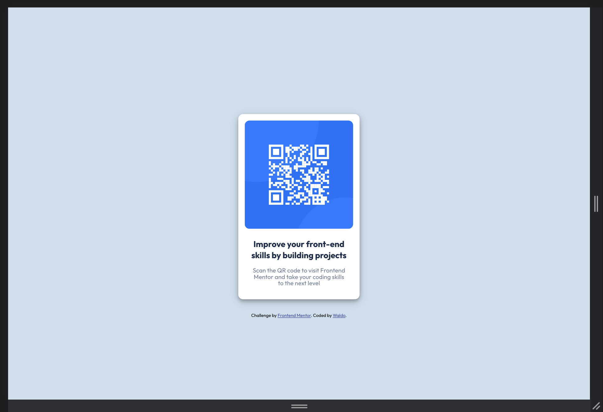

# Frontend Mentor - QR code component solution

This is a solution to the [QR code component challenge on Frontend Mentor](https://www.frontendmentor.io/challenges/qr-code-component-iux_sIO_H). Frontend Mentor challenges help you improve your coding skills by building realistic projects. 

## Overview

This is a simple front-end challenge from Frontend Mentor. In this challenge I had to create a card using html and css and style it appropriately. For this challege I was only given a few images as a guide for the design and a couple of styling directions that included the colors and font along with the set sizes.

### Screenshot

### Built with

- Semantic HTML5 markup
- CSS custom properties
- Flexbox
- CSS Grid
- Mobile-first workflow
- [Styled Components](https://styled-components.com/) - For styles

## Conclusion 

Overall this was a fun project to tackle and I now have a bunch of new CSS trick up my sleeve. I definitly suggest giving this challenge a try if you are trying to improve your CSS. 